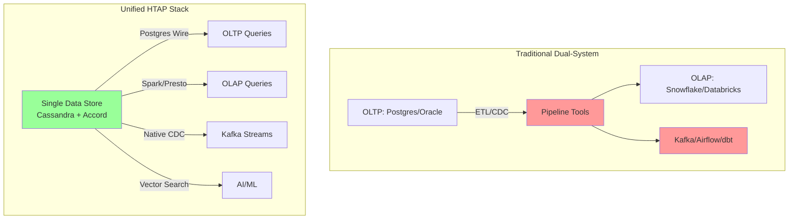
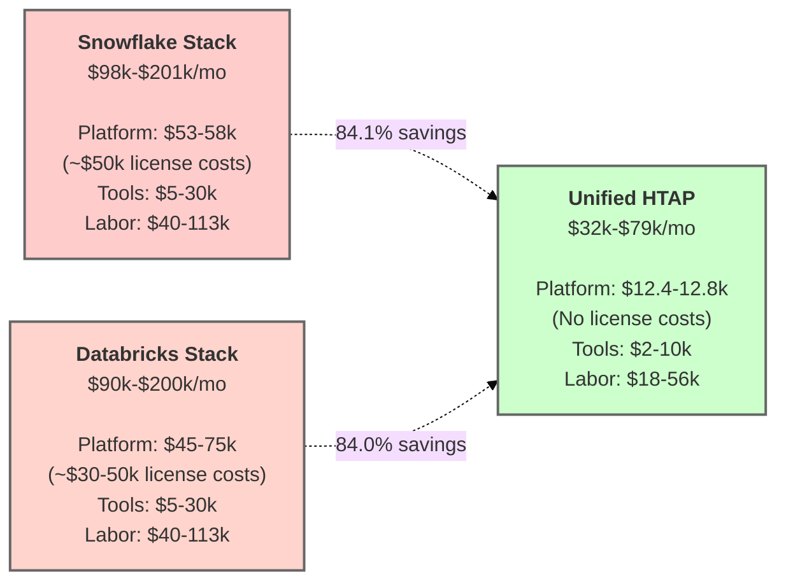

# TCO savings estimates against Snowflake, Databricks, and Postgres (illustrative)

This document is an **order-of-magnitude worksheet**, not a benchmark report or a vendor price quote. It’s intended to make assumptions explicit and *auditable*, so readers can swap in their own numbers (credits, hours, regions, discounts, labor rates, etc.).

It models a fairly common enterprise shape:

- **Strict OLTP SLOs** (low p99 latency, high concurrency)
- **Frequent point-in-time analytics** (snapshot-scoped)
- **Daily heavier Spark jobs**
- **On-demand cloud pricing** (for comparability)

It compares a “dual-system” approach (OLTP + separate analytics platform + pipeline) versus a unified HTAP approach.

> **Disk assumption for this model:** **20 TB per data node** (EBS-backed).  
> **Dataset assumption:** 20 TB logical “hot” dataset, **RF=3**.

It also demonstrates that Open Source Software does not mean a "free lunch" - the cost of running a unified HTAP stack is not zero, but it is significantly lower than the cost of running a dual-system stack.  Instead TCO reductions can be seen to come from both how standardisation offers _freedom to operate_ and how the more modern capabilities impact on infrastructure layers.

---

## How this HTAP stack delivers these savings

The unified architecture demonstrated in this repository eliminates costs through:

- **Accord transactions (CEP-15)**: Strict-serializable ACID without separate transaction coordinators or consensus overhead.
  - While neither OLTP nor OLAP systems can achieve such Strict-serializable alone, Accord now also provides basic Consistency guarantees over a unified data platform.  This can have a material impact on developer productivity and operational complexity.
- **Spark bulk reader/writer via Sidecar (CEP-28)**: Analytics on persisted structures (SSTables) without ETL pipelines.
- **Multiple SQL interfaces on one data store**:
  - Postgres wire protocol for OLTP (application SQL)
  - Spark/Presto for OLAP (analytical SQL)
  - No data duplication between interfaces
- **Snapshot-coordinated analytics**: Point-in-time consistency for analytics without copying data to warehouses.
- **Native Kafka CDC via Sidecar**: Built-in change streams with RF-aware deduplication, no third-party connectors.
- **Vector similarity search**: Native support without separate vector database licensing.

This eliminates the "dual-system pipeline tax" (tools + people) that dominates TCO in traditional OLTP + OLAP architectures.

---

## Scenario assumptions (monthly)

- **Hot dataset (logical):** 20 TB
- **Replication factor (RF):** 3 ⇒ **~60 TB raw**
- **Operational headroom:** +30% (compaction, streaming, repair, snapshots, safety) ⇒ **~78 TB raw**
- **Workload shape:** streaming ingest + strict OLTP SLOs + frequent snapshot analytics + daily heavier Spark jobs
- **Cost posture:** on-demand pricing, single region (examples use AWS us-east-1)

---

## What’s included vs excluded

### Included (explicit in math below)
- Primary platform bills (compute + storage)
- A **separate line item** for the “pipeline tax” of dual systems:
  - **Tools/SaaS** commonly added in practice (ingestion/orchestration/observability)
  - **People cost bands** (incremental labor attributable to running dual platforms + pipelines)

### Not included (high-variance; call out in reviews)
- Data transfer / egress charges
- Reserved Instances / Savings Plans / committed-use discounts
- Vendor-negotiated enterprise discounts
- Backups/DR beyond what is implicitly assumed
- Security/compliance platform costs (IAM, key mgmt, audit tooling)
- "Cost of delay" / opportunity cost (usually dominates, but hard to quantify)

> **Validation note**: These calculations use publicly documented pricing and credit consumption rates. For your specific evaluation:
> - Run the demo stack in this repository to measure actual resource utilization for your workload
> - Use vendor calculators with your actual query patterns and duty cycles
> - Request quotes from vendors for your specific workload shape and volume
>
> This worksheet is a starting point for TCO discussions, not a substitute for measured data from your environment.

---

# A) Postgres + ETL/CDC + Snowflake (representative monthly)

## Snowflake unit pricing (illustrative)
Snowflake's own cost examples commonly use:
- **$2.00 per credit**
- **$23 per TB-month** storage
Both appear in Snowflake documentation examples.

> **Key cost driver**: Snowflake charges for  compute credits on top of underlying cloud infrastructure. This is a **license markup** that doesn't exist in open-source alternatives.

## Illustrative compute usage (warehouse sizing math)
Credit burn by warehouse size is documented (e.g., **Large = 8 credits/hr**, **2X-Large = 32 credits/hr**).

Assume:

- BI / ad-hoc: **2X-Large (32 credits/hr)**, **2 clusters**, **12 h/day**
  = 32 × 2 × 12 × 30 = **23,040 credits/month**
- ELT / feature builds: **Large (8 credits/hr)**, **8 h/day**
  = 8 × 8 × 30 = **1,920 credits/month**

**Snowflake compute subtotal**
- Total credits: 23,040 + 1,920 = **24,960 credits/month**
- Spend: 24,960 × $2.00 = **$49,920/month** **(~$50k/month in license fees)**

**Snowflake storage subtotal**
- 20 TB × $23/TB-month = **$460/month**

**Snowflake subtotal (compute + storage):** **~$50,380/month**
- **Of which ~$49,920 is license/credit costs**

> Notes readers will challenge (fairly):
> - Auto-suspend, serverless features, Snowpipe, clustering, and “always-on” warehouses can materially change totals.
> - Many orgs negotiate different effective $/credit.

## Postgres + Kafka + pipeline infrastructure (order-of-magnitude)

This varies dramatically by HA posture, scale, and managed-vs-self-hosted choices.

### Managed service approach (typical for enterprises avoiding ops burden):
- **RDS Postgres** (db.r6g.2xlarge Multi-AZ, 20TB storage): ~$1,200/month compute + ~$2,300/month storage = **~$3,500/month**
- **MSK (Managed Kafka)** (3 brokers, kafka.m5.large): **~$1,800/month**
- **S3 staging storage** (20TB + versioning for intermediate data): **~$500/month**
- **Orchestration** (Managed Airflow/Prefect/Dagster): **~$500–$2,000/month**
- **Subtotal: ~$6.3k–$7.8k/month**

### Self-hosted approach (more ops burden, lower cloud bills):
- **EC2 for Postgres HA** (2x r6g.2xlarge + 20TB EBS gp3): **~$1,400/month**
- **EC2 for Kafka cluster** (3x m5.large + EBS): **~$600/month**
- **S3 staging**: **~$500/month**
- **Subtotal: ~$2.5k/month**

**Conservative band for comparisons: $2.5k–$8k/month**

## Dual-system “pipeline tax” (tools + people)
This is the portion that’s commonly **glossed over** and is often the real TCO driver.

### Tooling/SaaS bands (very common in practice)
- Managed ingestion/connectors, orchestration, catalog, observability, quality tooling: **~$5k–$30k/month**

### Incremental labor bands (typical enterprise reality)
Not total headcount—this is the incremental labor that tends to appear when you run **two platforms + pipelines**:

- Data engineering (ELT/CDC, modeling, backfills, schema drift): **1.0–2.0 FTE**
- Analytics engineering (semantic layer, dbt, metrics definitions, governance integration): **0.5–1.0 FTE**
- Platform/SRE (Postgres HA + Kafka + orchestration + reliability): **0.5–1.0 FTE**
- Data quality operations (monitoring, incident response, reconciliation): **0.25–0.5 FTE**

**Incremental total:** **~2.25–4.5 FTE**

Fully-loaded cost per FTE-month varies by geography and seniority; a realistic planning band is:
- **$18k–$25k per FTE-month**

So the **incremental people cost** attributable to dual-system + pipelines is often:
- 2.25–4.5 × $18k–$25k ⇒ **~$40k–$113k/month**

## A) Indicative total
Two ways to report, depending on how honest you want to be about ops reality:

- **Platform bill only (cloud/vendor):**
  \~$50.4k (Snowflake) + ($2.5k–$8k) (Postgres+Kafka) = **\~$53k–$58k/month**
  - ** Of which ~$50k is Snowflake license costs (94% of platform bill)**
- **More realistic, fully-loaded (bill + tools + incremental labor):**
  \~$53k–$58k + ($5k–$30k tools) + ($40k–$113k labor) = **\~$98k–$201k/month**
  - ** License costs: \~$50k/month (51% of low end, 25% of high end)**

---

# B) Postgres + ETL/CDC + Databricks (representative monthly)

##  Databricks pricing model
Databricks cost is harder to model from a single "credits" number because it varies by:
- cluster types (interactive vs jobs vs serverless),
- DBUs (Databricks Units)  **( compute units)**,
- and the underlying cloud VMs.

> **Key cost driver**: Databricks charges DBU markups on top of underlying cloud compute. Like Snowflake, this is a ** license layer** that adds 50-150% markup over raw cloud costs.

Databricks provides product pricing and calculators, but the exact $/month depends on how clusters are configured and kept running.

## B) Indicative total (banded)
If you hold the same "interactive + batch" workload shape as above, it is common to see:

- **Platform bill only:** **~$45k–$75k/month** (high variance)
  - ** Estimated ~$30k–$50k is Databricks  DBU license costs (67-75% of platform bill)**
- **Fully-loaded (bill + tools + incremental labor):**
  Add similar pipeline tax bands as (A) ⇒ **~$90k–$200k/month**
  - **  license costs: ~$30k–$50k/month (33-56% of total)**

> If you want this section to be harder to argue with, replace the band with a concrete calculator output from *your* intended cluster topology and duty cycle.

---

# C) Oracle + ETL/CDC + Snowflake (representative monthly)

This section intentionally uses list-price mechanics to show why Oracle licensing commonly dominates TCO at scale. In real enterprises, discounting can be substantial, but the *shape* of the math remains.

## Oracle processor licensing reminder
- Oracle's **Processor Core Factor Table** is how many shops compute required processor licenses; for many Intel/AMD server CPUs, **core factor is commonly 0.5**.

## Snowflake portion
Reuse Snowflake math from (A): **~$50.4k/month** (compute + storage)

## C) Indicative total
Keeping your original “Oracle software dominates” intent:

- Oracle software (amortized license + support): **very often six figures/month** (environment-dependent)
- Snowflake: **~$50k/month**
- Pipeline tax (tools + people): **often $40k–$140k/month**

This is why many enterprises experience “TCO runaway” even when individual components are tuned.

---

# D) Unified open-source HTAP stack (SQL + transactions + Spark/Presto + Kafka)

## 100% Open Source

This section updates the earlier sizing and pricing so it matches the stated assumption:

- **20 TB disks per node**
- **EBS-backed storage**
- **Cheapest EC2 instance matching i4i.2xlarge CPU+RAM** when using EBS

> **Critical difference**: This stack uses **entirely open-source software** (Apache Cassandra, Apache Spark, Apache Kafka, Presto). You pay only for the underlying cloud infrastructure (compute + storage).

## D.1 Data node sizing (capacity-first)
- Raw required: 20 TB logical × RF=3 = **60 TB raw**
- With 30% headroom: **~78 TB raw**

With **20 TB/node**, capacity-driven minimum is:
- 78 / 20 = 3.9 ⇒ **4 data nodes** (tight)
- More operationally realistic: **6 data nodes** (more streaming/repair slack, better failure domain tolerance)

## D.2 Cheapest EC2 instance for EBS (matching 8 vCPU / 64 GiB)
Using on-demand us-east-1 pricing:

- **r6g.2xlarge** (8 vCPU, 64 GiB): **$0.4032/hr**, **$294.34/month**

## D.3 EBS pricing for 20 TB disks (gp3)
Amazon EBS gp3 list pricing (us-east-1 example on AWS docs):
- **$0.08/GB-month**
- **3,000 IOPS and 125 MB/s included**, with add-on pricing above that

Per-node storage cost:
- 20 TB = 20 × 1024 = **20,480 GB**
- 20,480 × $0.08 = **$1,638.40 per node-month**

## D.4 Monthly infrastructure estimate (EBS-backed)

- Data nodes:
  - Compute: 6 × $294.34 = **$1,766.04**
  - Storage: 6 × $1,638.40 = **$9,830.40**
  - **Subtotal:** **$11,596.44/month**
- Service nodes + Spark (as above): **~$800–$1,200/month**

**Infra total (realistic posture):** **~$12.4k–$12.8k/month**

## D.5 Operational cost (more specific, still banded)
A unified stack still requires good operators, but it avoids most dual-system pipeline overhead.

Typical incremental labor bands:
- Platform/SRE for the unified platform: **0.75–1.5 FTE**
- Analytics engineering (semantic layer, governance integration): **0.25–0.75 FTE**

**Total:** **~1.0–2.25 FTE** ⇒ **~$18k–$56k/month** (using the same $18k–$25k per FTE-month band)

Tooling/SaaS tends to be lower (fewer connectors + less reconciliation):
- **~$2k–$10k/month**

## D.6 AI/ML workload value (not quantified in base TCO, but material)

The unified HTAP approach provides additional value for AI/ML workloads:

- **Real-time feature stores**: No ETL lag between OLTP writes and ML feature availability (eliminates feature staleness)
- **Vector similarity search**: Native support without separate vector database licensing or data sync
- **Agentic AI data access**: Single governance/security layer for all data modalities (OLTP, OLAP, vectors)
- **Reduced training data staleness**: Analytics/ML models train on fresh data without pipeline delays
- **Simplified MLOps**: Fewer data copies to version, validate, and reconcile

These capabilities avoid costs that would otherwise appear as:
- Separate vector database licenses (e.g., Pinecone, Weaviate: $500–$5k+/month)
- Feature store platforms (e.g., Tecton, Feast managed: $2k–$10k+/month)
- Additional data engineering labor for feature pipelines and reconciliation

## D.7 Operational maturity considerations

While the unified HTAP stack reduces architectural complexity, enterprises should budget for:

### Initial investment (one-time or first 12 months):
- **Training/upskilling**: Cassandra operations, Accord transactions, Spark bulk I/O patterns (~$20k–$50k for team training)
- **Migration tooling**: Schema conversion, data migration from legacy systems (varies widely by source system complexity)
- **Runbook development**: Failure scenarios, repair procedures, upgrade workflows (~$10k–$30k consulting/documentation)

### Ongoing operational differences:
- **Fewer moving parts**: No separate ETL orchestration, fewer connectors to maintain
- **Monitoring consolidation**: Single platform observability vs multi-system correlation (reduces tool sprawl)

The labor bands in Section D.5 reflect steady-state operations after initial ramp-up (typically 3–6 months).

> **Note**: This is a POC stack (see README). Production deployments should budget for additional operational tooling (observability, backup/restore automation, DR orchestration) and validate SQL feature coverage for specific workloads.

## D) Indicative total
- **Platform bill only (cloud):** **~$12.4k–$12.8k/month**
  - **No license costs — 100% open source**
  - **All costs are raw cloud infrastructure (compute + storage)**
- **Fully-loaded (bill + tools + labor):** **~$32k–$79k/month**

---

##### **E) Unified open-source HTAP stack — on-prem hardware (one-off CapEx)**

This section mirrors (D), but replaces monthly cloud bills with a **one-time hardware purchase** and (optionally) an **amortized monthly equivalent** for apples-to-apples comparison.

> This is a **BOM-style estimate**. On-prem pricing varies widely by vendor, discount level, spares posture, and whether you already have rack/switching.

---

###### **E.1 Hardware sizing (same dataset and headroom as D)**

* Raw required: 20 TB logical × RF=3 = **45 TB raw + head-room**
Assume **~20 TB usable NVMe per data node**, implemented as:

- **3 × 7.68 TB NVMe U.2 (PCIe Gen4)** striped (≈ 23.04 TB raw), leaving room for filesystem + operational slack

Procurement posture:

* **6 data nodes** + **2 service nodes** = **8 servers**

---

###### **E.2 Unit cost assumptions (illustrative street pricing)**

**Servers (compute/RAM baseline per node)**
Use a 1U single-socket server class with **≥8 cores** and **64 GB RAM**. As a concrete reference point, the HPE Store (US) lists an HPE ProLiant DL325 Gen11 Smart Choice configuration "starting at" **$5,339** (reseller-indicative pricing).
For budgeting, use:

* **$5,300–$7,500 per server** (depends on CPU, NICs, rails, PSU redundancy, support level)

**7.68 TB enterprise NVMe U.2 (PCIe Gen4)**  
Representative “new/in-stock” listing example: Samsung PM9A3 7.68TB at **$2,000**. 

**Top-of-rack switching (25GbE example)**
A representative 48×25GbE data-center switch price example: **$10,732** (discounted "our price" listing for an Arista 7050X3 configuration).
Budget:

* **$6k–$15k** depending on brand/new-vs-used/support

**NICs + optics/cabling + rack/PDU (typical adders)**
These vary a lot by standards and vendor. Budget placeholders (edit to your standards):

* **$300–$900 per server** (25GbE NIC + optics/cables allocation)
* **$1,500–$4,000** (rack accessories / PDU allocation if needed)

---

###### **E.3 One-off CapEx estimate (two postures)**

The tables below use **point estimates** for clarity:

* Servers: **$5,339 each**
- 7.68 TB NVMe: **$2,000**
* Switch: **$10,732**
* NIC/optics/cables: **$500 per server** (placeholder)
* Rack/PDU allocation: **$2,000** (placeholder)
* Contingency/spares: **10%** (recommended for spares + shipping + variance)

###### **6 data + 2 service (8 servers total)**

| Line item | Qty | Unit | Extended |
|---|---:|---:|---:|
| Servers (≥8 cores, 64 GB baseline) | 8 | $5,339 | $42,712 |
| 7.68 TB NVMe U.2 Gen4 (data, 3 per data node) | 18 | $2,000 | $36,000 |
| 1.92 TB NVMe U.2 Gen4 (commit log, optional but recommended) | 6 | $750 | $4,500 |
| 25GbE ToR switch | 1 | $10,732 | $10,732 |
| NICs/optics/cables (allocation) | 8 | $500 | $4,000 |
| Rack/PDU/accessories (allocation) | 1 | $2,000 | $2,000 |
| **Subtotal** |  |  | **$99,944** |
| Contingency + spares (10%) |  |  | **$9,994** |
| **One-off CapEx total** |  |  | **~$109,938** |

---

###### **E.4 Optional: amortized “monthly equivalent” (for comparison to cloud)**

This is not a cash cost—just a way to compare against monthly cloud spend.

 One-off CapEx | 36-mo amortization | 60-mo amortization |
|---:|---:|---:|
| ~$109.9k | ~$3.05k/mo | ~$1.83k/mo |

---

# Recalculated savings (using the same workload assumptions)

Because "fully-loaded" depends mostly on org structure and labor accounting, the cleanest comparison is **platform bill only** (compute + storage + baseline infra).

## Versus Postgres + ETL + Snowflake (~$53k–$58k/month platform bill)
**Unified HTAP platform bill: ~$12.4k–$12.8k/month**

### Platform bill savings breakdown:
- **Snowflake  license costs eliminated:** ~$50k/month 
- **Remaining infrastructure comparison:**
  - Traditional: ~$3k–$8k (Postgres + Kafka + pipeline infra)
  - HTAP: ~$12.4k–$12.8k (unified infrastructure)
- **Net platform savings:** **~$40k–$45k/month (76-78%)**

### Why HTAP costs more than just "Postgres + Kafka":
The HTAP stack **replaces three separate systems** (OLTP + OLAP + pipeline) with one unified platform that:
- Handles both transactional and analytical workloads
- Provides native Spark/Presto analytics (no Snowflake needed)
- Includes built-in CDC and streaming (no separate pipeline tools)
- Supports vector search and AI/ML workloads

**The key insight:** You're comparing ~$12.8k of open-source infrastructure against ~$50k of Snowflake license fees alone.

### Fully-loaded savings (including labor):
- Traditional: **~$98k–$201k/month**
- HTAP: **~$32k–$79k/month**
- **Savings: ~$66k–$122k/month (61-67%)**

## Versus Postgres + ETL + Databricks (~$45k–$75k/month platform bill)
**Unified HTAP platform bill: ~$12.4k–$12.8k/month**

### Platform bill savings breakdown:
- **Databricks  DBU license costs eliminated:** ~$30k–$50k/month 
- **Remaining infrastructure comparison:**
  - Traditional: ~$15k–$25k (Postgres + Kafka + pipeline + base compute)
  - HTAP: ~$12.4k–$12.8k (unified infrastructure)
- **Net platform savings:** **~$32k–$62k/month (72-83%)**

### Fully-loaded savings (including labor):
- Traditional: **~$90k–$200k/month**
- HTAP: **~$32k–$79k/month**
- **Savings: ~$58k–$121k/month (64-74%)**

## Versus Oracle + Snowflake (platform bill commonly far higher)
Savings are typically very large because the Oracle software envelope dominates at scale.

**Key insight:** Oracle license costs alone often exceed $100k/month, plus Snowflake's ~$50k/month. The HTAP stack eliminates both  license layers.

## Additional value not quantified in base TCO
- **AI/ML capabilities**: Eliminates $2.5k–$15k+/month in separate vector DB and feature store costs
- **Reduced time-to-insight**: No ETL lag means faster business decisions (opportunity cost)
- **Simplified governance**: Single security/audit layer vs federated policies across multiple systems

---

# Critique / common objections (and how to pre-empt them)

If you want this page to survive critical readers, expect these pushbacks:

1. **"These Snowflake hours are arbitrary."**
   True. They're placeholders. The doc explicitly calls out that it's a *duty-cycle assumption* and invites readers to swap in their own duty cycle. Use Snowflake's calculator with your actual query patterns.

2. **"You ignored discounts / commitments."**
   Also true. We keep on-demand for comparability, but committed-use discounts apply to *both* approaches and can be layered on later. Enterprise discounts often favor incumbents (Snowflake/Databricks) but also apply to cloud infrastructure (AWS/GCP/Azure).

3. **"Labor estimates are hand-wavy."**
   They are, but leaving them out is worse. The fix is to present them as *bands* and make the underlying role assumptions explicit (this doc does that). The "pipeline tax" (dual-system labor overhead) is the real TCO driver in most enterprises.

4. **"EBS cost dominates; why not instance-store?"**
   Correct: with 20 TB/node, gp3 storage becomes the main infra cost line. If you want to model instance-store (i4i/i3en), you need a different node shape (and different operational tradeoffs around durability and repair).

5. **"This is a POC, not production-ready."**
   True (see README line 295). The TCO model assumes production-hardened deployment. Enterprises evaluating this stack should:
   - Budget for additional operational tooling (observability, backup/restore automation, DR orchestration)
   - Validate SQL feature coverage for their specific workloads (see README lines 386-391 on Postgres compatibility)
   - Plan for DR drills and failure injection testing (README lines 475-482)
   - Consider managed service options if/when available (not modeled here)
   - Account for initial training/migration investment (see Section D.7)

PRs that replace any band with measured numbers (or calculator outputs) will improve the credibility of this document substantially.
