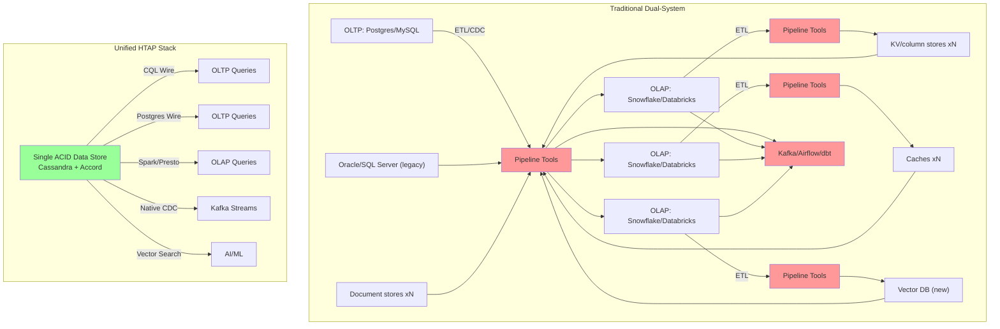
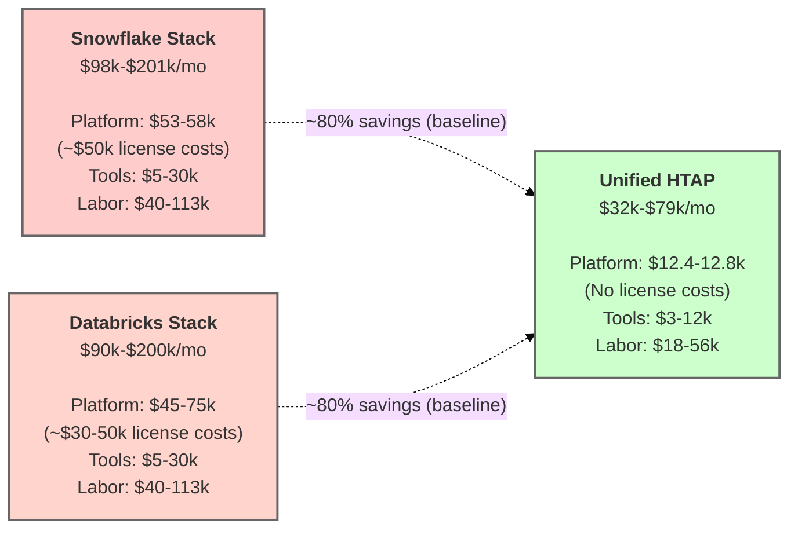

# TCO savings estimates vs Snowflake, Databricks, and Postgres (illustrative)

This document is an **order-of-magnitude worksheet**, not a benchmark report or a vendor price quote. It's intended to make assumptions explicit and *auditable*, so readers can swap in their own numbers (credits, hours, regions, discounts, labour rates, duty cycles) and re-derive the answer for their own environment.

It models a common enterprise shape:

- **Strict OLTP SLOs** (low p99 latency, high concurrency)
- **Frequent point-in-time analytics** (snapshot-scoped)
- **Daily heavier Spark jobs**
- **On-demand cloud pricing** (for comparability)

It compares a dual-system approach (OLTP + separate analytics platform + pipeline) against a unified HTAP approach.

> **Disk assumption for this model:** **20 TB per data node** (EBS-backed).
> **Dataset assumption:** 20 TB logical "hot" dataset, **RF=3**.

Open-source software does not mean a free lunch. The cost of running a unified HTAP stack is not zero, it's just significantly lower than the cost of running a dual-system stack. TCO reductions come from two places: standardisation offers *freedom to operate*, and the more modern architectural capabilities reduce infrastructure-layer costs.

This document supports the general claim of 80%+ TCO savings over Snowflake or Databricks, and is conservative in nature – many derivations will arrive at much higher savings.  In reality the real savings to an enterprise comes from a data platform that is flexible in how you migration and adopt to it, and to your end solution state.  This stack is neither opinionated nor forcing you into unifying all your data into a single system.  

---

## Contents

- [How this HTAP stack delivers these savings](#how-this-htap-stack-delivers-these-savings)
- [Scenario assumptions](#scenario-assumptions-monthly)
- [What's included vs excluded](#whats-included-vs-excluded)
- [A) Postgres + ETL + Snowflake](#a-postgres--etlcdc--snowflake-representative-monthly)
- [Snowflake sensitivity: savings at different duty cycles](#snowflake-sensitivity-savings-at-different-duty-cycles)
- [B) Postgres + ETL + Databricks](#b-postgres--etlcdc--databricks-representative-monthly)
- [C) Oracle + ETL + Snowflake](#c-oracle--etlcdc--snowflake-representative-monthly)
- [D) Unified open-source HTAP stack (cloud)](#d-unified-open-source-htap-stack-sql--transactions--sparkpresto--kafka)
- [E) Unified open-source HTAP stack (on-prem CapEx)](#e-unified-open-source-htap-stack--on-prem-hardware-one-off-capex)
- [Recalculated savings](#recalculated-savings-using-the-same-workload-assumptions)
- [Critique / common objections](#critique--common-objections-and-how-to-pre-empt-them)

---

## How this HTAP stack delivers these savings

The unified architecture demonstrated in this repository eliminates costs through:

- **Accord transactions (CEP-15)** — strict-serializable ACID without separate transaction coordinators or external consensus overhead. Neither OLTP nor OLAP systems achieve strict-serializability alone; Accord now provides that guarantee across a unified data platform. This has a material impact on developer productivity and operational complexity.
- **Spark Bulk Reader/Writer via Sidecar (CEP-28)** — analytics on persisted structures (SSTables) without ETL pipelines.
- **Multiple SQL interfaces on one data store**:
  - Postgres wire-protocol for OLTP (application SQL)
  - Spark / Presto for OLAP (analytical SQL)
  - No data duplication between interfaces
- **Snapshot-coordinated analytics** — point-in-time consistency for analytics without copying data to warehouses.
- **Native Kafka CDC via Sidecar** — built-in change streams with RF-aware deduplication, no third-party connectors.
- **Vector similarity search** — native support without separate vector-database licensing.

This eliminates the **dual-system pipeline tax** (tools + people) that dominates TCO in traditional OLTP + OLAP architectures.

The dual-system diagram above deliberately shows the compounded case — multiple OLAP warehouses, caches, vector stores, document stores, and their pipelines — because this is what enterprises *actually accumulate* over 5-10 years of bolting on new data modalities. Your environment may be simpler today; it likely will not be in three years.

---

## Scenario assumptions (monthly)

- **Hot dataset (logical):** 20 TB
- **Replication factor (RF):** 3 ⇒ **~60 TB raw**
- **Operational headroom:** +30% (compaction, streaming, repair, snapshots, safety) ⇒ **~78 TB raw**
- **Workload shape:** streaming ingest + strict OLTP SLOs + frequent snapshot analytics + daily heavier Spark jobs
- **Cost posture:** on-demand pricing, single region (examples use AWS us-east-1)

---

## A note on "no license costs"

This stack uses entirely Apache-licensed software. There are no per-credit, per-DBU, or per-core software licensing fees. That's a meaningful structural difference from Snowflake, Databricks, and Oracle.

**However**: enterprises adopting this stack in production will typically contract commercial support for Cassandra, Spark, and Kafka, from IBM, DataStax, Databricks, Confluent, or equivalents. Commercial support contracts commonly run **20-40% of the eliminated software-licensing cost** for equivalent production coverage, and should be modelled separately against the savings figures below.

The "no license costs" line in the platform-bill comparisons refers specifically to the per-credit/per-DBU usage fees that do not exist in open-source alternatives. Support, services, and training investments should be modelled as separate line items based on your organisation's operational posture and risk tolerance.

---

## What's included vs excluded

### Included (explicit in math below)

- Primary platform bills (compute + storage)
- A separate line item for the "pipeline tax" of dual systems:
  - **Tools/SaaS** commonly added in practice (ingestion, orchestration, catalog, observability, quality)
  - **People cost bands** (incremental labour attributable to running dual platforms + pipelines)

### Not included (high-variance; call out in reviews)

- Data transfer / egress charges
- Reserved Instances / Savings Plans / committed-use discounts
- Vendor-negotiated enterprise discounts
- Backups/DR beyond what is implicitly assumed
- Security/compliance platform costs (IAM, key management, audit tooling)
- Commercial support contracts (see "no license costs" note above)
- "Cost of delay" / opportunity cost (usually dominates, but hard to quantify)

> **Validation note**: These calculations use publicly documented pricing and credit consumption rates. For your specific evaluation:
>
> - Run the demo stack in this repository to measure actual resource utilization for your workload
> - Use vendor calculators with your actual query patterns and duty cycles
> - Request quotes from vendors for your specific workload shape and volume
>
> This worksheet is a starting point for TCO discussions, not a substitute for measured data from your environment.

---

# A) Postgres + ETL/CDC + Snowflake (representative monthly)

## Snowflake unit pricing (illustrative)

Snowflake's own cost examples commonly use:

- **$2.00 per credit**
- **$23 per TB-month** storage

Both appear in Snowflake documentation examples.

> **Key cost driver**: Snowflake charges compute credits on top of underlying cloud infrastructure. This is a **license markup** that does not exist in open-source alternatives, though, as noted above, commercial support contracts for open-source stacks partially recreate equivalent vendor spend.

## Illustrative compute usage (warehouse sizing math)

Credit burn by warehouse size is documented (e.g., **Large = 8 credits/hr**, **2X-Large = 32 credits/hr**).

Assume:

- BI / ad-hoc: **2X-Large (32 credits/hr)**, **2 clusters**, **12 h/day**
  = 32 × 2 × 12 × 30 = **23,040 credits/month**
- ELT / feature builds: **Large (8 credits/hr)**, **8 h/day**
  = 8 × 8 × 30 = **1,920 credits/month**

**Snowflake compute subtotal**

- Total credits: 23,040 + 1,920 = **24,960 credits/month**
- Spend: 24,960 × $2.00 = **$49,920/month** (~$50k/month in license fees)

**Snowflake storage subtotal**

- 20 TB × $23/TB-month = **$460/month**

**Snowflake subtotal (compute + storage):** **~$50,380/month**

- Of which ~$49,920 is license/credit costs

> Notes readers will challenge (fairly):
>
> - Auto-suspend, serverless features, Snowpipe, clustering, and "always-on" warehouses can materially change totals.
> - Many orgs negotiate different effective $/credit.
> - Real duty cycles vary widely; **see the sensitivity table below** for how savings shift at different Snowflake bills.

## Postgres + Kafka + pipeline infrastructure (order-of-magnitude)

This varies dramatically by HA posture, scale, and managed-vs-self-hosted choices.

### Managed service approach (typical for enterprises avoiding ops burden)

- **RDS Postgres** (db.r6g.2xlarge Multi-AZ, 20TB storage): ~$1,200/month compute + ~$2,300/month storage = **~$3,500/month**
- **MSK (Managed Kafka)** (3 brokers, kafka.m5.large): **~$1,800/month**
- **S3 staging storage** (20TB + versioning for intermediate data): **~$500/month**
- **Orchestration** (Managed Airflow/Prefect/Dagster): **~$500–$2,000/month**
- **Subtotal: ~$6.3k–$7.8k/month**

### Self-hosted approach (more ops burden, lower cloud bills)

- **EC2 for Postgres HA** (2× r6g.2xlarge + 20 TB EBS gp3): **~$1,400/month**
- **EC2 for Kafka cluster** (3× m5.large + EBS): **~$600/month**
- **S3 staging**: **~$500/month**
- **Subtotal: ~$2.5k/month**

**Conservative band for comparisons: $2.5k–$8k/month**

## Dual-system "pipeline tax" (tools + people)

This is the portion that is commonly **glossed over** and is often the real TCO driver.

### Tooling comparison: what both stacks actually need

Both architectures require observability, catalog, quality monitoring, and backup tooling. The dual-system stack requires additional categories because of the pipeline; the HTAP stack requires all the same categories but typically fewer tools within each.

| Category | Dual-system | HTAP |
|---|---|---|
| Observability (metrics, logs, traces) | Per-system dashboards, cross-system correlation | Single-platform observability + Kafka |
| Data catalog / lineage | Multi-system federation | Single-system catalog + CDC consumers |
| Data quality monitoring | Pre-ETL + post-ETL reconciliation | Single-source validation |
| Backup / restore | Per-system tooling | Unified snapshots |
| Ingestion / orchestration | Airflow/Dagster/Prefect + CDC connectors | Kafka + native CDC (sidecar) |
| ML / feature tooling | Feature store + vector DB often separate | Native vector + snapshot-based feature reads |

**Typical band estimates:**

- **Dual-system tooling**: **$5k–$30k/month** — the pipeline categories (ingestion, orchestration, cross-system reconciliation) are what expand the range
- **HTAP tooling**: **$3k–$12k/month** — same core categories; the band comes from still needing Kafka monitoring and ML tooling, just fewer tools per category

The HTAP savings on tooling come from **collapsed categories** (fewer connectors, no cross-system reconciliation), not from the HTAP stack requiring fundamentally less observability or governance. Governance still matters; it's just applied once instead of federated.

### Incremental labour bands (typical enterprise reality)

This is the incremental labour that tends to appear when you run **two platforms + pipelines**:

- Data engineering (ELT/CDC, modelling, backfills, schema drift): **1.0–2.0 FTE**
- Analytics engineering (semantic layer, dbt, metrics definitions, governance integration): **0.5–1.0 FTE**
- Platform/SRE (Postgres HA + Kafka + orchestration + reliability): **0.5–1.0 FTE**
- Data quality operations (monitoring, incident response, reconciliation): **0.25–0.5 FTE**

**Incremental total:** **~2.25–4.5 FTE**

**Fully-loaded cost per FTE-month** varies by geography, seniority, and specialization:

- **Generalist data engineers (dual-system roles)**: $18k–$25k per FTE-month in most North American and Northern European markets
- **Specialist operators (Cassandra/Accord/Spark-bulk)**: typically commands a 15–25% premium given smaller labour pools, particularly outside major tech hubs

For planning purposes this doc uses the **$18k–$25k** band uniformly, but organisations should adjust the HTAP side upward for specialist roles unless they already have in-house Cassandra expertise. In Oslo, London, or Berlin the specialist premium is real; in Bangalore, Mountain View, or Seattle it's smaller.

So the **incremental people cost** attributable to dual-system + pipelines is often:

- 2.25–4.5 × $18k–$25k ⇒ **~$40k–$113k/month**

## A) Indicative total

Two ways to report, depending on how honest you want to be about ops reality:

- **Platform bill only (cloud/vendor):**
  ~$50.4k (Snowflake) + ($2.5k–$8k) (Postgres + Kafka) = **~$53k–$58k/month**
  - Of which ~$50k is Snowflake license costs (86-94% of platform bill)
- **More realistic, fully-loaded (bill + tools + incremental labour):**
  ~$53k–$58k + ($5k–$30k tools) + ($40k–$113k labour) = **~$98k–$201k/month**
  - License costs: ~$50k/month (25–51% of fully-loaded total)

---

## Snowflake sensitivity: savings at different duty cycles

The $50k/month Snowflake number above assumes two 2X-Large warehouses at 12h/day, a specific, relatively heavy duty cycle. Many Snowflake deployments run at significantly lower utilization with aggressive auto-suspend. This table shows how the savings claim holds up across a range of realistic Snowflake bills.

| Snowflake monthly bill | Workload profile | Platform-bill savings vs HTAP | Fully-loaded savings vs HTAP |
|---|---|---|---|
| **$12k** | Auto-suspend aggressive, short ELT windows, light BI | roughly break-even | 30–45% |
| **$25k** | Single 2X-L warehouse, 8h/day + ELT | ~40% | 45–60% |
| **$50k** | Two 2X-L warehouses, 12h/day + ELT (doc baseline) | ~75% | 60–70% |
| **$80k** | Heavy BI concurrency, multiple warehouses always-on | ~85% | 70–80% |
| **$150k+** | Large enterprise with multiple data domains | ~90%+ | 80–85% |

**HTAP platform bill held constant at ~$12.5k/month across scenarios.**

Two honest observations:

1. **At low Snowflake spend, the TCO argument weakens.** If your Snowflake bill is $10–15k/month, the infrastructure savings alone don't justify a migration. The argument at that scale shifts to architectural benefits: data freshness, no ETL staleness, unified governance, reduced data-platform complexity. Those benefits are real but harder to quantify in dollars, and they may or may not outweigh migration cost for your organisation.

2. **At high Snowflake spend, the TCO argument dominates.** At $50k+/month, the architectural benefits become almost incidental, the infrastructure savings alone pay for the migration several times over. This is where the unified architecture makes most sense financially.

Use your actual Snowflake bill (or Databricks DBU spend) to locate yourself on this table. The point of the worksheet is that the right answer depends on where you are, not on which architecture is categorically "better."

---

# B) Postgres + ETL/CDC + Databricks (representative monthly)

## Databricks pricing model

Databricks cost is harder to model from a single "credits" number because it varies by:

- cluster types (interactive vs jobs vs serverless),
- DBUs (Databricks Units) as the compute unit,
- and the underlying cloud VMs being consumed.

> **Key cost driver**: Databricks charges DBU markups on top of underlying cloud compute. Like Snowflake, this is a **license layer** that adds 50–150% markup over raw cloud costs.

Databricks provides product pricing and calculators, but the exact $/month depends heavily on how clusters are configured and kept running.

## B) Indicative total (banded)

If you hold the same "interactive + batch" workload shape as Section A, it is common to see:

- **Platform bill only:** **~$45k–$75k/month** (high variance)
  - Estimated ~$30k–$50k is Databricks DBU license costs (67–75% of platform bill)
- **Fully-loaded (bill + tools + incremental labour):**
  Add similar pipeline-tax bands as (A) ⇒ **~$90k–$200k/month**
  - License costs: ~$30k–$50k/month (33–56% of total)

> If you want this section to be harder to argue with, replace the band with a concrete calculator output from *your* intended cluster topology and duty cycle.

---

# C) Oracle + ETL/CDC + Snowflake (representative monthly)

This section intentionally uses list-price mechanics to show why Oracle licensing commonly dominates TCO at scale. In real enterprises, discounting can be substantial, but the *shape* of the math remains.

## Oracle processor licensing reminder

- Oracle's **Processor Core Factor Table** is how many shops compute required processor licenses; for many Intel/AMD server CPUs, **core factor is commonly 0.5**.

## Snowflake portion

Reuse the Snowflake math from (A): **~$50.4k/month** (compute + storage).

## C) Indicative total

Keeping the original "Oracle software dominates" intent:

- Oracle software (amortised license + support): **very often six figures/month** (environment-dependent; unsourced but widely reported)
- Snowflake: **~$50k/month**
- Pipeline tax (tools + people): **often $40k–$140k/month**

This is why many enterprises experience "TCO runaway" even when individual components are individually well-tuned. **Key insight**: Oracle license costs alone often exceed $100k/month in larger deployments, plus Snowflake's ~$50k/month. The HTAP stack eliminates both license layers.

---

# D) Unified open-source HTAP stack (SQL + transactions + Spark/Presto + Kafka)

This section sizes the unified stack to match the same assumptions:

- **20 TB disks per node**
- **EBS-backed storage**
- **Cheapest EC2 instance matching i4i.2xlarge CPU+RAM** when using EBS

> **Critical difference**: This stack uses **entirely open-source software** (Apache Cassandra, Apache Spark, Apache Kafka, Presto). You pay only for the underlying cloud infrastructure (compute + storage) — plus commercial support if you elect to contract it separately.

## D.1 Data-node sizing (capacity-first)

- Raw required: 20 TB logical × RF=3 = **60 TB raw**
- With 30% headroom: **~78 TB raw**

With **20 TB/node**, capacity-driven minimum is:

- 78 / 20 = 3.9 ⇒ **4 data nodes** (tight)
- More operationally realistic: **6 data nodes** (more streaming/repair slack, better failure-domain tolerance)

## D.2 Cheapest EC2 instance for EBS (matching 8 vCPU / 64 GiB)

Using on-demand us-east-1 pricing:

- **r6g.2xlarge** (8 vCPU, 64 GiB): **$0.4032/hr**, **$294.34/month**

## D.3 EBS pricing for 20 TB disks (gp3)

Amazon EBS gp3 list pricing (us-east-1 example):

- **$0.08/GB-month**
- **3,000 IOPS and 125 MB/s included**, with add-on pricing above that

Per-node storage cost:

- 20 TB = 20 × 1024 = **20,480 GB**
- 20,480 × $0.08 = **$1,638.40 per node-month**

## D.4 Monthly infrastructure estimate (EBS-backed)

- Data nodes:
  - Compute: 6 × $294.34 = **$1,766.04**
  - Storage: 6 × $1,638.40 = **$9,830.40**
  - **Subtotal:** **$11,596.44/month**
- Service nodes + Spark: **~$800–$1,200/month**

**Infra total (realistic posture):** **~$12.4k–$12.8k/month**

### Where the analytical compute cost lives

A reasonable question: if the dual-system column pays Snowflake/Databricks for analytical compute, where does that compute cost appear in the HTAP column?

**Answer: it's absorbed by the data nodes themselves.** The Cassandra Spark Bulk Reader reads persisted SSTables directly from data-node disks; Spark executors run on the data nodes (or on adjacent service nodes sharing the same network fabric), and the analytical workload consumes CPU and I/O on infrastructure that is already provisioned for OLTP.

This works because:

1. OLTP workloads typically under-utilize CPU relative to I/O, there's headroom for analytical scans on the same nodes.
2. Analytical reads go through a different code path (direct SSTable reads via the Sidecar) that doesn't contend with the OLTP request queues, coordinator threads, or read-repair paths.
3. At roughly 1.7 Gb/s per-node analytical throughput, a 6-node data cluster sustains ~10 Gb/s of scan bandwidth **without separate OLAP compute provisioning**.

**Caveat**: if analytical workloads are sustained at full throughput 24/7 (unusual), node sizing should increase. The 6-node cluster here assumes bursty analytical load, heavy daily batch windows, frequent ad-hoc queries, not continuous saturation. For continuous heavy analytics, add 25-50% data-node count as a sizing margin.

## D.5 Operational cost (more specific, still banded)

A unified stack still requires good operators, but it avoids most dual-system pipeline overhead.

Typical incremental labour bands:

- Platform/SRE for the unified platform: **0.75–1.5 FTE**
- Analytics engineering (semantic layer, governance integration): **0.25–0.75 FTE**

**Total:** **~1.0–2.25 FTE** ⇒ **~$18k–$56k/month** (using the $18k–$25k per FTE-month band; see specialist-premium note in Section A).

Tooling/SaaS tends to be lower (fewer connectors, less reconciliation): **~$3k–$12k/month**.

## D.6 AI/ML workload value (not quantified in base TCO, but material)

The unified HTAP approach provides additional value for AI/ML workloads:

- **Real-time feature stores** — no ETL lag between OLTP writes and ML feature availability (eliminates feature staleness)
- **Vector similarity search** — native support without separate vector-database licensing or data sync
- **Agentic AI data access** — single governance/security layer for all data modalities (OLTP, OLAP, vectors)
- **Reduced training data staleness** — analytics/ML models train on fresh data without pipeline delays
- **Simplified MLOps** — fewer data copies to version, validate, and reconcile

These capabilities avoid costs that would otherwise appear as:

- Separate vector database licenses (e.g., Pinecone, Weaviate: $500–$5k+/month)
- Feature store platforms (e.g., Tecton, managed Feast: $2k–$10k+/month)
- Additional data engineering labour for feature pipelines and reconciliation

## D.7 Operational maturity considerations

While the unified HTAP stack reduces architectural complexity, enterprises should budget for:

### Initial investment (one-time or first 12 months)

- **Training/upskilling** — Cassandra operations, Accord transactions, Spark bulk I/O patterns: ~$20k–$50k for team training
- **Migration tooling** — schema conversion, data migration from legacy systems (varies widely by source system complexity)
- **Runbook development** — failure scenarios, repair procedures, upgrade workflows: ~$10k–$30k consulting/documentation

### Ongoing operational differences

- **Fewer moving parts** — no separate ETL orchestration, fewer connectors to maintain
- **Monitoring consolidation** — single-platform observability vs multi-system correlation, reduces tool sprawl
- **Specialist skill concentration** — fewer people need deeper knowledge, vs more people needing broader knowledge across multiple platforms

The labour bands in Section D.5 reflect steady-state operations after initial ramp-up (typically 3-6 months).

> **Note**: This is a POC stack (see README). Production deployments should budget for additional operational tooling (observability, backup/restore automation, DR orchestration) and validate SQL feature coverage for specific workloads.

## D) Indicative total

- **Platform bill only (cloud):** **~$12.4k–$12.8k/month**
  - No per-credit/per-DBU license costs: 100% open source
  - All costs are raw cloud infrastructure (compute + storage)
  - Commercial support (if contracted): modelled separately, typically $3k–$15k/month for this scale
- **Fully-loaded (bill + tools + labour):** **~$32k–$79k/month**

---

## E) Unified open-source HTAP stack – on-prem hardware (one-off CapEx)

This section mirrors (D), but replaces monthly cloud bills with a **one-time hardware purchase** and (optionally) an **amortized monthly equivalent** for apples-to-apples comparison.

> This is a **BOM-style estimate**. On-prem pricing varies widely by vendor, discount level, spares posture, and whether you already have rack/switching infrastructure.

### E.1 Hardware sizing (same dataset and headroom as D)

- Raw required: 20 TB logical × RF=3 = **60 TB raw** + headroom
- Assume **~20 TB usable NVMe per data node**, implemented as:
  - **3 × 7.68 TB NVMe U.2 (PCIe Gen4)** striped (≈ 23.04 TB raw), leaving room for filesystem + operational slack

Procurement posture:

- **6 data nodes** + **2 service nodes** = **8 servers**

### E.2 Unit cost assumptions (two procurement postures)

Hardware pricing varies significantly by procurement channel. This worksheet offers two postures.

#### Reseller / street pricing (self-hosted posture, minimal support)

As a concrete reference point, the HPE Store (US) lists an HPE ProLiant DL325 Gen11 Smart Choice configuration starting at **$5,339** (reseller-indicative pricing).

- Servers (≥8 cores, 64 GB RAM): **$5,300–$7,500** (depends on CPU, NICs, rails, PSU redundancy, support level)
- 7.68 TB enterprise NVMe U.2 (PCIe Gen4): **~$2,000** (representative: Samsung PM9A3 7.68TB)
- 48×25GbE ToR switch: **$6k–$15k** (representative: Arista 7050X3 configuration at ~$10,732)
- NICs + optics/cabling: **$300–$900 per server** (25GbE NIC + optics/cables)
- Rack/PDU accessories: **$1,500–$4,000** per rack

#### Enterprise procurement (24×7×4 support, NBD parts, chassis redundancy)

Real enterprise procurement with support contracts typically runs 1.6–1.8× reseller pricing:

- Servers: **$8,000–$15,000** each (includes 3-year support)
- NVMe drives with enterprise warranty: **$2,500–$3,500** each
- ToR switch with support contract: **$12,000–$22,000**

The tables in E.3 use the **reseller/street** posture for the lower-bound estimate. For enterprise budgeting, multiply server and drive line items by ~1.6–1.8× and add a hardware-support line (~$8k–$15k/year for an 8-server cluster).

**Contingency**: this worksheet uses 10% for the street posture. Enterprise procurement with variance in switch pricing, rail kits, optics, and spares typically requires **15–20%** contingency.

### E.3 One-off CapEx estimate (reseller/street posture)

The table below uses **point estimates** for clarity:

- Servers: **$5,339 each**
- 7.68 TB NVMe: **$2,000 each**
- Switch: **$10,732**
- NIC/optics/cables: **$500 per server** (placeholder)
- Rack/PDU allocation: **$2,000** (placeholder)
- Contingency/spares: **10%** (recommended for spares + shipping + variance)

**6 data + 2 service (8 servers total)**

| Line item | Qty | Unit | Extended |
|---|---:|---:|---:|
| Servers (≥8 cores, 64 GB baseline) | 8 | $5,339 | $42,712 |
| 7.68 TB NVMe U.2 Gen4 (data, 3 per data node) | 18 | $2,000 | $36,000 |
| 1.92 TB NVMe U.2 Gen4 (commit log, optional but recommended) | 6 | $750 | $4,500 |
| 25 GbE ToR switch | 1 | $10,732 | $10,732 |
| NICs/optics/cables (allocation) | 8 | $500 | $4,000 |
| Rack/PDU/accessories (allocation) | 1 | $2,000 | $2,000 |
| **Subtotal** |  |  | **$99,944** |
| Contingency + spares (10%) |  |  | **$9,994** |
| **One-off CapEx total (street posture)** |  |  | **~$109,938** |

**Enterprise procurement equivalent**: multiply hardware line items by \~1.7× and use 15-20% contingency ⇒ **\~$180k–$220k one-off**, plus \~$10k–$15k/year hardware support.

### E.4 Optional: amortized "monthly equivalent" (for comparison to cloud)

This is not a cash cost, just a way to compare against monthly cloud spend.

| Posture | One-off CapEx | 36-mo amortization | 60-mo amortization |
|---|---:|---:|---:|
| Street/self-hosted | ~$110k | ~$3.1k/mo | ~$1.8k/mo |
| Enterprise procurement | ~$200k | ~$5.6k/mo | ~$3.3k/mo |

**Not included in amortization**: datacenter costs (power, cooling, rackspace), hardware refresh cycle, ongoing support contracts, ops labour for bare-metal operations.

---

# Recalculated savings (using the same workload assumptions)

Because "fully-loaded" depends heavily on org structure and labour accounting, the cleanest comparison is **platform bill only** (compute + storage + baseline infra).

## Versus Postgres + ETL + Snowflake (~$53k–$58k/month platform bill)

**Unified HTAP platform bill: ~$12.4k–$12.8k/month**

### Platform bill savings breakdown

- **Snowflake license costs eliminated:** ~$50k/month
- **Remaining infrastructure comparison:**
  - Traditional: ~$3k–$8k (Postgres + Kafka + pipeline infra)
  - HTAP: ~$12.4k–$12.8k (unified infrastructure)
- **Net platform savings:** **~$40k–$45k/month (76–78%)**

### Why HTAP costs more than just "Postgres + Kafka"

The HTAP stack **replaces three separate systems** (OLTP + OLAP + pipeline) with one unified platform that:

- Handles both transactional and analytical workloads
- Provides native Spark/Presto analytics (no Snowflake needed)
- Includes built-in CDC and streaming (no separate pipeline tools)
- Supports vector search and AI/ML workloads natively

**The key insight**: you're comparing ~$12.8k of open-source infrastructure against ~$50k of Snowflake license fees alone.

### Fully-loaded savings (including labour)

- Traditional: **~$98k–$201k/month**
- HTAP: **~$32k–$79k/month**
- **Savings: ~$66k–$122k/month (61–67%)**

## Versus Postgres + ETL + Databricks (~$45k–$75k/month platform bill)

**Unified HTAP platform bill: ~$12.4k–$12.8k/month**

### Platform bill savings breakdown

- **Databricks DBU license costs eliminated:** ~$30k–$50k/month
- **Remaining infrastructure comparison:**
  - Traditional: ~$15k–$25k (Postgres + Kafka + pipeline + base compute)
  - HTAP: ~$12.4k–$12.8k (unified infrastructure)
- **Net platform savings:** **~$32k–$62k/month (72–83%)**

### Fully-loaded savings (including labour)

- Traditional: **~$90k–$200k/month**
- HTAP: **~$32k–$79k/month**
- **Savings: ~$58k–$121k/month (64–74%)**

## Versus Oracle + Snowflake (platform bill commonly far higher)

Savings are typically very large because the Oracle software envelope dominates at scale.

**Key insight**: Oracle license costs alone often exceed $100k/month in larger deployments, plus Snowflake's ~$50k/month. The HTAP stack eliminates both license layers.

## Additional value not quantified in base TCO

- **AI/ML capabilities** — eliminates $2.5k–$15k+/month in separate vector DB and feature-store costs
- **Reduced time-to-insight** — no ETL lag means faster business decisions (opportunity cost, typically dominant but hard to quantify)
- **Simplified governance** — single security/audit layer vs federated policies across multiple systems

*Percentages reflect the doc baseline assumptions (Snowflake at ~$50k/month, Databricks at $30-50k/month DBU spend). Actual savings depend on duty cycle – see the sensitivity table in Section A.*

---

# Critique / common objections (and how to pre-empt them)

If you want this page to survive critical readers, expect these pushbacks:

1. **"These Snowflake hours are arbitrary."**
   True. They're placeholders chosen to model a common heavy-utilisation scenario. The sensitivity table in Section A shows savings at $12k, $25k, $50k, $80k, and $150k Snowflake bills, which covers the range most enterprises actually experience. Use Snowflake's calculator with your actual query patterns and locate yourself on the table.

2. **"You ignored discounts and committed-use pricing."**
   Also true. We keep on-demand pricing for comparability, but committed-use discounts apply to *both* approaches and can be layered on later. Enterprise discounts often favour incumbents (Snowflake/Databricks negotiate hard at renewal) but also apply to cloud infrastructure (AWS/GCP/Azure Reserved Instances and Savings Plans).

3. **"Labour estimates are hand-wavy."**
   They are, but leaving them out would be worse. The fix is to present them as *bands* and make the underlying role assumptions explicit (this doc does that). The "pipeline tax": dual-system labour overhead; is the real TCO driver in most enterprises. The specialist-premium note in Section A acknowledges that HTAP labour may cost more per FTE than dual-system labour, depending on geography.

4. **"EBS cost dominates; why not instance-store?"**
   Correct: with 20 TB/node, gp3 storage becomes the main infra cost line. If you want to model instance-store (i4i/i3en), you need a different node shape, and different operational trade-offs around durability, repair, and node-replacement workflows. The worksheet uses EBS because it generalises better across cloud providers; instance-store optimizations are a follow-on exercise.

5. **"This is a POC, not production-ready."**
   While this is a Proof-of-Concept demo, all features are available in open source releases that have been running in production deployments for many years (see README).
   
   The TCO model assumes production-hardened deployment. Enterprises evaluating this stack should:
   - Budget for additional operational tooling (observability, backup/restore automation, DR orchestration)
   - Validate SQL feature coverage for specific workloads (see ARCHITECTURE.md §E)
   - Plan DR drills and failure-injection testing (see ARCHITECTURE.md §H.6)
   - Consider managed-service options if/when available (not modelled here)
   - Account for initial training/migration investment (see Section D.7)
   - Model commercial-support contracts separately (see "no license costs" note)

6. **"The cluttered dual-system diagram is a strawman."**
   The diagram shows a compounded case, multiple OLAP warehouses, caches, vector stores, and pipelines. Not every enterprise is there today. But most enterprises that have been running dual-system architectures for 5+ years have accumulated most of those boxes, because every new data modality (search, cache, vector, feature store) gets added as yet another system with its own pipeline. If your environment is genuinely simpler, good, but the trajectory for most organisations points toward the compounded case, not away from it.

7. **"The HTAP labour numbers assume skills you don't yet have."**
   Correct. Section D.7 accounts for 3-6 months of ramp-up and $20k–$50k in team training. The specialist-premium note in Section A acknowledges the ongoing skills premium. For organisations without Cassandra expertise, the first-year cost is higher than steady-state; steady-state savings are the multi-year argument.

