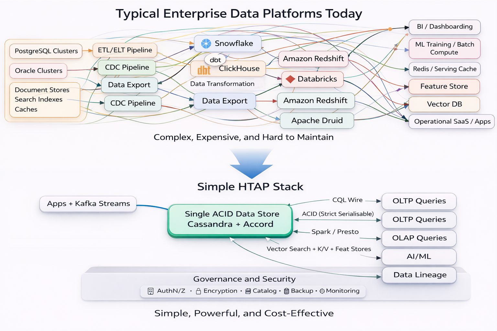

# Why: The argument for one interoperable data platform

One data platform for all your needs, like the good old days of the RDBMS, but no longer a monolith.

This document is the argument for the approach. The [README](../README.md) covers the quickstart; [ARCHITECTURE.md](ARCHITECTURE.md) covers the technical scope; [TCO-Comparisons.md](TCO-Comparisons.md) covers the money.

## Contents

- [The inherited architecture](#the-inherited-architecture)
- [What actually changed](#what-actually-changed)
- [Why AI workloads expose the dual-system cost](#why-ai-workloads-expose-the-dual-system-cost)
- [ACID guarantees at scale](#acid-guarantees-at-scale)
- [SQL compatibility, honestly](#sql-compatibility-honestly)
- [Vector similarity search: a compounding case against separation](#vector-similarity-search-a-compounding-case-against-separation)
- [Why Presto and Apache Spark: different analytical access patterns](#why-presto-and-apache-spark-different-analytical-access-patterns)
- [When the defaults break down](#when-the-defaults-break-down)
- [What to take from this](#what-to-take-from-this)

---

## The inherited architecture

Your application database handles writes. Your data warehouse handles analytics. Your ETL pipelines connect them. Your data scientists complain about stale data. Your platform team owns three systems, four schemas, and a Friday incident rotation.

None of this was inevitable. It was a workaround to technical limitations that no longer apply. We just forgot.

The transactional/analytical split made sense when RAM was expensive, consensus protocols were slow, and columnar scans blocked the write path. Those constraints have shifted quietly over the last five to ten years. The architecture most of us inherited now costs more than it earns, and the cost is compounding, because every new data modality (search indexes, vector stores, feature stores, caches) gets bolted on as yet another duplicated copy behind yet another pipeline.

This is not a new problem. The industry has been aware of the duplication tax for at least fifteen years. What's new is that the technical foundations to solve it properly, distributed consensus protocols with single-round-trip latency, columnar scans that don't contend with write paths, commodity hardware fast enough to serve both workloads from one dataset, all landed within roughly the same five-year window. The tools caught up with the problem, and most enterprise architectures have not yet noticed.

---

## What actually changed

Three specific shifts made the unified approach viable:

**1. Consensus protocols got faster.** Paxos and Raft require multiple round trips and have a leader bottleneck. EPaxos improved on this. Accord (CEP-15) provides strict-serializable distributed transactions in a single wide-area round trip, leaderless, using commodity clocks, the same isolation class Google Spanner offers, without Spanner's TrueTime commit-wait. The cost of a distributed transaction dropped from "multiple RTTs plus clock wait" to "one RTT plus quorum."

**2. Storage-tiered compute got normal.** Compute/storage separation, treating analytics as a set of compute workloads that share the same persisted data, moved from specialist territory to well-understood architecture. The idea that OLAP should have its own storage tier is itself an artifact of the old constraints.

**3. Direct-to-storage analytical paths got built.** The Cassandra Spark Bulk Reader (CEP-28) reads SSTables directly from disk via snapshots, bypassing the OLTP request path entirely. This eliminates the contention that traditionally forced OLAP into a separate system. Analytics read the same storage the OLTP path writes to, without fighting it.

Individually these are incremental improvements. Composed, they remove the technical justification for the dual-system architecture. What remains is inertia.

---

## Why AI workloads expose the dual-system cost

AI agents and retrieval-augmented systems share one access pattern with traditional applications and one with analytics:

- **Like applications**, they need low-latency point lookups and strong consistency. Stale data produces wrong answers. There is no user tolerance for ETL lag between "data written" and "data retrievable by an agent."
- **Like analytics**, they need full-dataset scans for embedding generation, feature extraction, aggregation, and retraining.

In a traditional OLTP + warehouse architecture, AI workloads are forced to straddle both systems. Teams end up either:

- running AI retrieval against stale warehouse copies (wrong answers, confidently delivered), or
- building yet another specialized store (vector DB, feature store, cache tier) with its own ETL pipeline, which compounds the duplication problem the warehouse was supposed to solve.

The second path is dominant today, which is why enterprise data-platform spend is rising faster than enterprise data-platform value. Every new AI initiative adds infrastructure, and every piece of infrastructure needs a pipeline to keep it in sync with the system of record.

A unified HTAP store collapses this. The same record of truth serves application queries, vector similarity search, analytical scans for feature generation, and CDC to downstream ML pipelines. Governance is centralized by construction, not by federation across multiple systems.

**This problem is not novel to AI.** The same argument applied to real-time personalization, fraud detection, and operational analytics for the last decade. AI workloads just make the cost of the duplicated architecture more visible, because they exercise both access patterns simultaneously and they run hot enough that staleness becomes customer-visible.

Developers no longer get to pass analytics off as somebody else's problem. The data consumption patterns typical of analytical computation are now indistinguishable from the transactional application stack. If your platform architecture doesn't reflect that, it will be the thing that holds your AI initiatives back, not the models.

---

## ACID guarantees at scale

Many OLTP databases provide ACID semantics. **Serializability is rare**. **Strict serializability is rarer still**.

As load increases and storage becomes inherently distributed, transactional guarantees matter more, not less. Single-writer databases scale by careful partitioning; cross-partition transactions remain expensive or simply unavailable. Serializable isolation in production is already the exception. Strict serializability: the property that transactions appear to execute atomically at a single point in real time, globally; is offered by a handful of systems.

Why it matters: durability has to account for single points of failure and multiple simultaneous hardware failures. Systems that rely on a single writer or a single leader fail this test at scale. Leaderless strict-serializable consensus (Accord, Spanner) is the architectural answer; everything else is a trade-off against one of correctness, availability, or latency under failure.

This stack offers strict-serializable ACID across the entire data platform via Accord. That claim is defensible, bounded, and testable. See [ARCHITECTURE.md](ARCHITECTURE.md#b-how-strict-serializability-is-achieved-and-what-availability-means) for the mechanism and the bounds.

---

## SQL compatibility, honestly

SQL: particularly the Postgres dialect; is the lingua franca of developers and data analysts. It plays a valuable role early in the application lifecycle (when the domain model and schema change frequently) and throughout the lifecycle for data exploration, reporting, and BI tooling.

**A trade-off worth naming**: for applications with static, prepared access patterns, persisting a rigid relational schema to disk carries overhead that a wide-column or key-value layout does not. Whether that overhead matters depends on your workload: it is nearly invisible for many transactional workloads and meaningful for high-throughput write paths. This is why Cassandra's data model is what it is.

SQL, however, is an **interface layer**. It does not dictate storage. In this stack, SQL is implemented as a Postgres wire-protocol + dialect adapter over the transaction layer, using Apache Calcite, and with both Spark and Presto. SQL can be implemented on top of many storage engines given transactions and a key-value store. The same mechanism extends to document, graph, and other modalities.

This stack demonstrates three SQL interfaces against one data store:

- **Application SQL** (Postgres-shim, PoC subset) –– for workloads migrating from Postgres, or applications that want SQL's ergonomics without the overhead of Postgres itself
- **Partition-based analytical SQL** (Spark / Presto via Cassandra connector) –– for targeted analytical queries on known partitions
- **File-direct analytical SQL** (Spark Bulk Reader, optionally with Iceberg) –– for wide scans and bulk analytics

Different SQL interfaces for different access patterns. Federation with existing data sources becomes an integration problem, not an architectural one.

**What this does not claim**: full Postgres parity. The wire protocol and dialect adapter implement a subset. Validate against your application's actual SQL requirements; don't assume "Postgres-compatible" means "all of Postgres."

## Vector similarity search: a compounding case against separation

Vector search is where dual-system architecture fails most visibly, and fails fastest. Retrieval-augmented generation, semantic search, recommendation systems, and agentic retrieval all depend on approximate nearest-neighbour search over high-dimensional embeddings. The default industry response has been to stand up a dedicated vector database: Pinecone, Weaviate, Milvus, Qdrant; alongside the existing OLTP and OLAP stores. This is the third system bolted onto what was already a dual-system architecture, and it arrives with its own pipeline, its own governance surface, and its own consistency problem.

### The consistency problem, made concrete

Embeddings are derived data. Every document, product description, customer interaction, or support ticket that gets embedded must first exist in the system of record, then be read, transformed by an embedding model, and written to the vector store. That pipeline has the same properties as every other ETL pipeline: it adds latency, it can fail, it introduces staleness, and it creates a second source of truth that must be reconciled with the first.

The consistency problem that emerges is subtle and consequential. When a row in the source system changes: a product description is updated, a document revised, a customer record corrected; the embedding derived from that row is now stale. The vector store returns results based on the old embedding until the pipeline catches up. In RAG applications, this is a correctness failure: the agent retrieves content that no longer matches the source of truth, and then confidently generates text from it. The user sees an answer grounded in yesterday's version of the data.

Most teams underestimate the rate of change in their source data, discover this gap in production, and respond by building a second CDC pipeline to keep the vector store in sync. The pipeline-to-manage-the-pipeline problem. Each added consumer (search index, cache, feature store) compounds the reconciliation burden.

**The architectural alternative: vector indexes live in the system of record, alongside the source data they index.** A write to the source row updates the vector index through the same code path, with the same consistency guarantees, under the same transactional semantics. There is no pipeline to fail, no reconciliation to perform, no staleness to explain to end users. Governance for the vector column is the same governance that applies to the source data, not a second set of policies federated across a second system.

### Hybrid search: the structural advantage of co-located vectors and data
The consistency argument is necessary but not sufficient. The stronger argument is hybrid search: queries that combine vector similarity with structured predicates.

Real retrieval workloads are almost never pure vector similarity. They look like this:

> "Find the 10 most similar support tickets to this query, but only from this customer, only in the last 30 days, and only where the status is 'resolved' and the product line is 'database'."

In a separated vector store, that query is architecturally broken. You either:

- **filter-then-search:** query the OLTP store for matching rows, extract their IDs, send them to the vector store as a filter parameter, which is latency-expensive and often bumps into vector-store limits on filter-list size; or
- **search-then-filter:** ask the vector store for top-K similar items, then go back to the OLTP store to re-filter,which produces incomplete or wrong results when the filtered-out items were precisely the ones you wanted (the "blocked graph traversal" problem documented in comparative literature on HNSW-based systems with filtering); or
- **post-filter:** ask the vector store for a much larger top-K (say, 1000) and filter in the application tier, which wastes compute, increases latency, and still silently drops results when the true matches fall outside the oversample window.

Each approach is a workaround for the architectural mismatch of storing the structured data in one system and the vectors in another.

**Co-located vectors and data solve this directly.** In Cassandra 5.0, a vector column is just another column on an existing table. The vector index is a Storage-Attached Index (SAI), the same indexing infrastructure that supports scalar columns, and it lives alongside scalar indexes on the same table. A hybrid query is written natively in CQL:
```sql
SELECT * FROM support_tickets
WHERE customer_id = ?
  AND status = 'resolved'
  AND product_line = 'database'
  AND created_at > '2025-10-01'
ORDER BY query_vector ANN OF ?
LIMIT 10;
```
The SAI query engine resolves scalar predicates and the vector predicate through the same execution path, against the same storage engine, at the same consistency level. There is no cross-system hop, no oversample-and-filter workaround, no consistency gap between the structured filters and the vector similarity result. Hybrid search is a first-class access pattern rather than an architectural afterthought.

### Schema evolution: adding vectors without ceremony

The dual-system architecture treats "adding vector search" as an infrastructure project. A new service must be provisioned, a new pipeline built, a new governance boundary drawn, new operational runbooks written. For many enterprises this takes months and meaningful capital expense before the first retrieval query runs.

In the co-located architecture, adding vector search to an existing table is an `ALTER` statement and a `CREATE INDEX`:

```sql
ALTER TABLE documents ADD content_vector VECTOR<FLOAT, 1536>;
CREATE INDEX ON documents(content_vector) USING 'sai';
```
This is important in ways that are easy to understate. There is no cluster-wide schema-change lock, no stop-the-world propagation ceremony: Cassandra's schema changes are eventually consistent and gossip-propagated, designed to be tolerable in a live production cluster. There is no need to pre-provision spare capacity for a new service; the vector index storage grows with the existing table's storage, using the same nodes, the same replication factor, the same disk budget. There is no cross-team coordination with a platform group to stand up new infrastructure.

SAI itself was designed with this property in mind: it is fully compatible with zero-copy streaming, so bootstrapping or decommissioning nodes streams indexes along with SSTables rather than rebuilding them. Schema evolution for indexing: historically one of the most painful operational events in a database's life; becomes routine.

For teams whose existing tables already hold the data they need to embed, adding vector search is a day's work, not a quarter's project. That velocity difference compounds: it changes which vector-search use cases are worth attempting.

### JVector and DiskANN: why relevancy holds as datasets exceed memory
The architectural arguments above hold for any database that co-locates vectors with source data. The performance argument is more specific, and it matters because it determines whether the architecture is viable at enterprise scale.

The standard in-memory ANN algorithm, HNSW (Hierarchical Navigable Small World), is fast and accurate — when the index fits in RAM. At roughly 1.3× the raw vector size in memory (for the index plus full-precision vectors), HNSW achieves recall@10 above 0.95 and latencies in the single-digit milliseconds. This is the happy path most vector-database benchmarks operate in.

The problem: **HNSW's performance falls off a cliff when the index exceeds available memory**. At 100 million 1536-dimensional vectors, the in-memory footprint runs into hundreds of gigabytes. Either you provision machines large enough to hold the entire working set in RAM (expensive, and a scaling ceiling rather than a scaling strategy), or HNSW's access patterns begin hitting disk, and because HNSW's graph traversal is randomly-ordered from disk's perspective, the I/O amplification is severe. Recall and latency both degrade, and the degradation is non-linear.
DiskANN, developed by Microsoft Research, was designed specifically for this regime. It uses the Vamana graph algorithm, which produces denser, more robustly-connected graphs than HNSW's multi-layer structure, meaning fewer hops are required per search: combined with product quantization (PQ) compression of vectors. The compressed vectors stay in memory; the full-precision vectors live on disk. A query traverses the PQ-compressed graph in memory to identify candidate neighbours, then reads only the handful of candidates' full-precision vectors from disk for final ranking. Disk I/O is bounded by a small constant per query rather than scaling with graph-traversal depth.

**JVector** is the Java implementation of DiskANN, originally built by DataStax for Astra DB and now integrated into Apache Cassandra 5.0. It is a pure-Java embedded vector search engine, Apache-licensed, and has several architectural properties worth naming directly:

- **Multi-layer DiskANN** –– JVector combines the hierarchical structure of HNSW with Vamana within each layer, inheriting the connectivity advantages of DiskANN's graph structure while preserving the fast-traversal properties that made HNSW popular.
- **Product quantization with re-ranking** –– JVector keeps PQ-compressed vectors in memory for fast candidate selection, then re-ranks the top candidates using full-precision vectors fetched from disk. This preserves recall in the larger-than-memory regime where HNSW's recall collapses.
- **SIMD-accelerated operations** via Java's Panama Vector API –– index-build and query operations use hardware vector instructions, with an internal kmeans implementation reported at 5× the performance of Apache Commons Math's equivalent.
- **Incremental construction** –– the index is queryable while being built. There is no separate indexing phase, no stop-the-world rebuild, no delay between "vector written" and "vector searchable." This matters enormously for transactional workloads where writes arrive continuously.


Linear-scaling concurrent builds: index construction scales linearly to at least 32 threads; doubling threads halves build time. This is a meaningful engineering achievement; most HNSW implementations serialise or lock extensively during construction.

JVector has been noted as implementing the FreshDiskANN variant of DiskANN which is precisely the property that makes it suitable for an OLTP database's write patterns.

The empirical result is JVector maintains high recall as working sets exceed RAM, precisely where HNSW-based implementations degrade. This is not incremental, it's the property that determines whether vector search at enterprise embedding-corpus scale is affordable. For a 100-million-vector corpus, HNSW implementations require provisioning RAM for the full working set; JVector can serve the same workload with roughly 1/10th the RAM by keeping only PQ-compressed graphs in memory. The cost difference at cloud-pricing RAM rates is substantial, and it grows with corpus size.

Astra DB (DataStax's managed Cassandra offering, built on JVector) has been recognised as a Forrester Leader for  vector search capabilities. 

## Why Presto and Apache Spark: different analytical access patterns

Analytics is not a single workload. Interactive BI queries, ad-hoc exploration, scheduled reporting, ML feature generation, and batch aggregations all share the label "analytics" while having profoundly different execution profiles. A platform that collapses OLTP and OLAP onto one dataset must still offer the right engine for each analytical access pattern, or the unification becomes a regression for the analytical users.

This stack provides both Presto and Apache Spark as first-class analytical engines, reading the same persisted data through different paths optimised for different workloads. The division of labour is deliberate.

### Presto – interactive SQL at BI concurrency
Presto (and its Trino fork) was built at Facebook for interactive, federated SQL over heterogeneous data sources. Its strengths are low-latency query planning, cost-based optimization over joins, and concurrency models designed for many simultaneous BI users. In this stack, Presto connects to Cassandra via its Cassandra connector, runs queries that target specific partitions or bounded token ranges, and returns results with the latency profile BI tools expect (seconds, not minutes). Presto is the right engine when:

- users are interactive and expect sub-minute responses
- queries hit specific partitions or narrow ranges
- the workload is read-only SQL with standard aggregations and joins
- concurrency is high (many analysts, many dashboards, many agents)

### Apache Spark – bulk compute over the entire dataset
Spark was built for large-scale distributed computation and has matured into the standard tool for ETL, ML feature generation, and analytical workloads that touch substantial fractions of a dataset. In this stack, Spark has two distinct paths into Cassandra: the standard spark-cassandra-connector (for per-partition queries that benefit from Spark's distributed execution but not from bulk I/O), and the Spark Bulk Reader via the Sidecar (CEP-28) for wide scans that read SSTable files directly from snapshots. Spark is the right engine when:

- the workload touches large fractions of the dataset (wide scans, cross-partition aggregations, full-table statistics)
- the computation is non-trivial (feature engineering, ML training, complex transformations)
- batch latency (minutes to hours) is acceptable
- the read throughput requirement exceeds what the OLTP path can sustain without impact

**The architectural point is what these engines share, not what distinguishes them:** both read the same persisted data that the OLTP path writes to. There is no separate analytical copy, no reshaping into a columnar warehouse, no ETL window during which analytics are stale. The two engines give analytical users the right tool for their access pattern while preserving the core property of the unified architecture, one record of truth, accessed through paths optimised for each workload's SLO profile.

Why this matters for the overall thesis: in a dual-system architecture, the OLAP engine is the storage layer; Snowflake's compute and storage are co-designed, Databricks' Photon engine assumes Delta Lake. This coupling is what makes those systems fast for their intended workloads, but it also means the analytical engine locks in the storage decision. Choosing Snowflake means storing data in Snowflake's format, with Snowflake's governance, under Snowflake's operational model.

This stack decouples the analytical engine from the storage layer. Presto and Spark are the engines in this demo; they are not the only possible engines. Any tool that can read Cassandra's SSTables (directly or via Sidecar APIs) can serve analytical workloads against the same data. The choice of analytical engine becomes a workload-matching decision rather than a platform-migration decision, which is, architecturally, what "compute/storage separation" was supposed to mean before the cloud warehouses re-coupled them under a different brand.

The synergy across these three capabilities: native vector search, storage-layer CDC, decoupled analytical engines; is the unified architecture's actual argument. Each by itself is an optimisation. Together they represent an architectural property that dual-system stacks cannot replicate without recreating the duplication they were meant to avoid: every new access pattern, every new modality, every new downstream consumer is served from the same record of truth, without a new pipeline.

---

## When the defaults break down

Two received principles work well in most software contexts and break down at the data-platform layer. They're worth naming directly, because they're why dual-system architectures persist long after the trade-offs stop favouring them.

### "YAGNI: don't design for scale until you need to"

**Where it applies.** YAGNI is sound advice for application code. You can refactor a service, swap a framework, or replace an API layer in weeks. Over-engineering the application tier is a real and common failure mode, and YAGNI is a good corrective.

**Where it breaks.** Data platforms don't refactor in weeks. Migrating a petabyte-scale OLTP database to a different storage model is a multi-year project that often spans organizational restructuring. By the time "later" arrives, the technical debt is load-bearing, the team that built it has moved on, and the business has grown around its limitations.

The cost of scaling a data platform late is qualitatively different from the cost of scaling an application late:

- **Business-growth stalls** while the migration runs, and data-platform migrations that take 2-3 years are normal, not exceptional
- **Incidents multiply** during the migration because two platforms run in parallel
- **Opportunity cost compounds** because analytics, AI, and product initiatives stall waiting for the platform to catch up

The sunk cost of designing for scale early is, mostly, learning. The cost of scaling late is growth limitation, and sometimes business failure. These are not symmetric.

**The defensible version**: don't over-engineer your application schema, but do pick a data platform that can grow with the business. Choosing a platform that cannot scale is a decision that compounds for the life of the company.

### "Analytics is a separate responsibility and platform"

**Where it applies.** When analytics workloads are genuinely offline (daily batch reports, quarterly aggregations) and staleness measured in hours is acceptable, this was most enterprises until roughly five years ago, and is still many enterprises today.

**Where it breaks.** When "analytics" starts including real-time personalization, fraud detection, operational dashboards, feature generation for ML, and AI retrieval, workloads where staleness is a bug, not a property, the separation between "application data" and "analytical data" becomes a source of incidents, not a clean architectural boundary.

The symptoms are predictable:

- Data scientists struggle with stale, fragmented, poor-quality data on insufficient tooling
- Engineering teams push analytics off as "not their problem" while being unable to deliver features that require fresh cross-system data
- Data mesh and data products appear as attempts to reconcile the split, they help in principle, but the current tactics (data fabrics, data products) do not address the core duplication
- Governance fragments across systems, creating compliance and security surface area

The era of agentic AI forces this to surface, because agent workloads are indistinguishable from transactional application stacks in their data access requirements. Enterprise data platforms need to be designed accordingly, ideally from the beginning, but increasingly, *now*, even if it requires rework.

**The defensible position**: analytics as a separate responsibility is a valid choice for some workloads and an increasingly expensive one for others. Recognize which category your workload falls into before accepting the default.

---

## What to take from this

Neither YAGNI nor "analytics is separate" is wrong. They're defaults that were right for a long time and are still right for many workloads.

The argument of this repo is that the trade-offs have shifted for a growing class of applications, and that when they shift, the cost of the inherited architecture becomes the dominant line item, both in dollars (see [TCO-Comparisons.md](TCO-Comparisons.md)) and in organizational capacity (the data platform becomes the thing that blocks everything else).

The harder argument: once you accept that the trade-offs have shifted, there is no graceful way to delay the reckoning. Dual-system architectures compound. Every new AI initiative, every new data modality, every new compliance requirement adds infrastructure and pipelines. The time to revisit the architecture is before the next compound.

This stack is one answer. It's not the only one. [ARCHITECTURE.md](ARCHITECTURE.md#hard-questions-faq) includes an honest comparison with CockroachDB, TiDB, YugabyteDB, SingleStore, Snowflake Hybrid Tables, and Postgres + Citus. Each is a different bet on the same problem. The point of this document is to make the problem visible, enabling your choice of solution.

*Turn database sprawl into something much simpler.*


